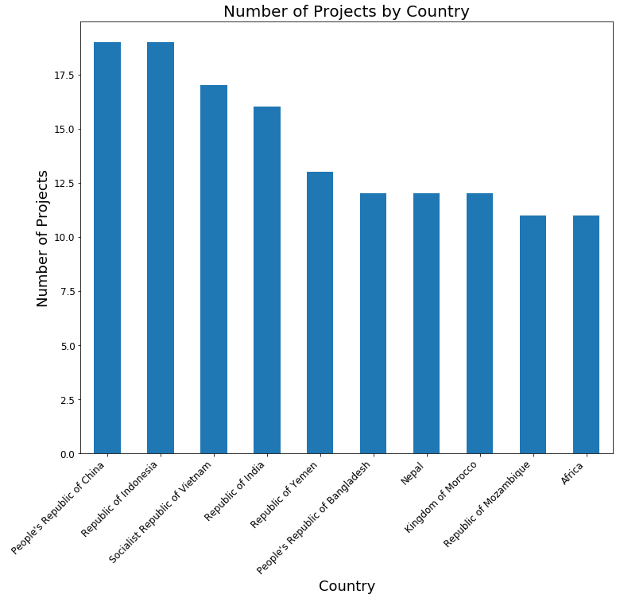
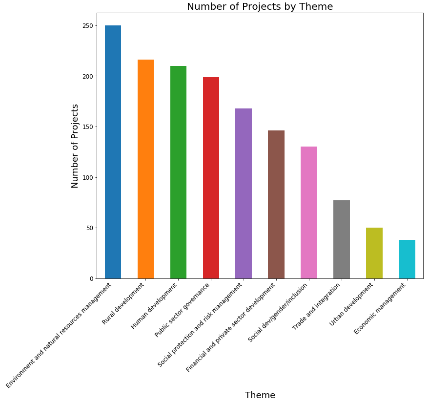

## JSON Data Wrangling - Springboard Project

This project explores data from a school quality improvement project in Ethopia to answer the following:

1. Find the top 10 countries with the most projects.

2. Find the top 10 major project themes.

The full analysis can be found in the jupyter notebook **'sliderule_ds_json_exercise.ipynb'**.